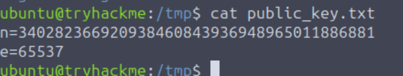
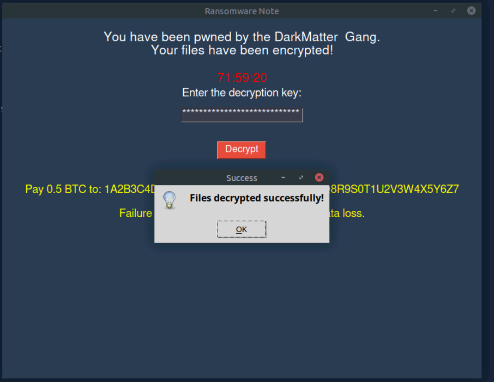

# Introduction
<p>The Hackfinitiy high school has been hit by DarkInjector's ransomware, and some of its critical files have been encrypted. We need you and Void to use your crypto skills to find the RSA private key and restore the files. After some research and reverse engineering, you discover they have forgotten to remove some debugging from their code. The ransomware saves this data to the tmp directory.</p>

1. In the infected system:
	```cd /tmp```
   ```cat private_key.txt```

   

3. [http://factor.db](http://factor.db)  to acquire the two factors of n

4. [https://www.tausquared.net/pages/ctf/rsa.html](https://www.tausquared.net/pages/ctf/rsa.html) Insert the values to acquire  d:

   